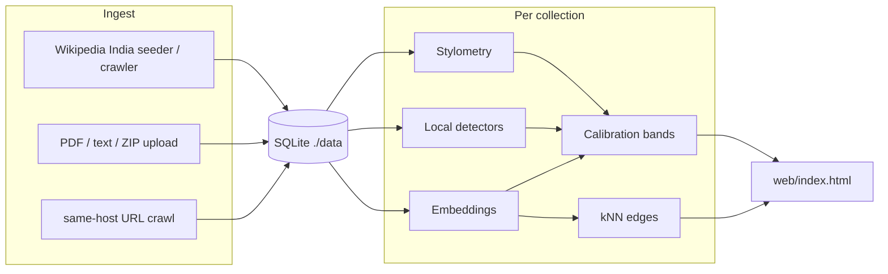

# KnowledgeOS

Collection-level estimate of how much of a document set looks AI-generated or AI-assisted.

This is **not** proof of authorship, not a Q&A / RAG system, and not HITS. GraphSAGE neighborhood embeddings are optional graph context only. They are **not** in the share number.

Collections are independent. Wikipedia India, a URL crawl named GDELT, PDF/text uploads, and other URL crawls do not share graphs or baselines.

The dashboard is `web/index.html`. The UI was not redesigned.

## Architecture

**C++20** + **CMake 3.20+** is the only runtime. SQLite file store at `./data/knowledgeos.db` (Docker: `/data/knowledgeos.db`). HTTP via cpp-httplib.

| Piece | What it does |
| --- | --- |
| Ingest | Simple PDF text extract; UTF-8 / HTML / JSONL / ZIP uploads; same-host URL crawl (depth 2, up to 80 pages). Wikipedia India is a separate crawler. |
| Analysis | Stylometry (TTR, burstiness, entropy, …), local detectors (stock phrases, sentence uniformity, n-gram repetition), hashed embeddings, collection-relative anomaly + deviation. |
| Calibration | Logistic blend of those signals + a modest post-ChatGPT date prior; rank mix; bands `LIKELY_AI` / `LIKELY_HUMAN` / `UNCERTAIN`. GraphSAGE is omitted from the headline. |
| Graph | Per-collection kNN on embedding cosine (`k=8`, min cosine `0.32`). The UI draws a circular cluster layout (unlabeled dots, subheading labels). |
| Wikipedia India | On start (if seeding is on): background crawl from India seeds, or a small offline fixture if crawl is off / unreachable. |
| GraphSAGE | Gated. Mean-aggregation fallback only. `usedInHeadline` is always false. Optional offline helper: `tools/graphsage/graphsage_embed.py`. |

On each process start, leftover collections that are **not** named `Wikipedia India` or `GDELT` are pruned. New uploads and URL crawls still work during that run.



## Build and run (Windows)

Needs **CMake 3.20+** and **MSVC** (Visual Studio Build Tools) or MinGW.

From this directory:

```bat
call "C:\Program Files (x86)\Microsoft Visual Studio\18\BuildTools\VC\Auxiliary\Build\vcvars64.bat"
cmake -S . -B build -G "NMake Makefiles" -DCMAKE_BUILD_TYPE=Release
cmake --build build
```

Binary: `build/knowledgeos.exe` (the `web/` dashboard is copied next to it).

```bat
set KNOWLEDGEOS_WIKIPEDIA_INDIA_CRAWL=false
build\knowledgeos.exe
```

Open [http://localhost:8080](http://localhost:8080).

To live-crawl English Wikipedia (same-host `en.wikipedia.org`, default cap **2000** pages, depth 4):

```bat
set KNOWLEDGEOS_WIKIPEDIA_INDIA_CRAWL=true
set KNOWLEDGEOS_WIKIPEDIA_INDIA_MAX_PAGES=2000
build\knowledgeos.exe
```

The app binds to 8080 first when crawl is on (crawl runs in a background thread). Header pills fill as pages are scored. If Wikipedia is unreachable, the small offline India fixture is installed so the dashboard still has a collection.

SQLite lives under `./data/knowledgeos.db`. Leave that directory in place so the India corpus can resume instead of starting over.

### Linux / Docker

```bash
cmake -S . -B build -DCMAKE_BUILD_TYPE=Release
cmake --build build
./build/knowledgeos
```

or

```bash
docker compose up --build
```

Cloud Run uses the same C++ `Dockerfile`. Containers honor `PORT`.

## How to use the dashboard

Same product UI as before.

1. **Dataset** — pick a collection, then **Refresh**. Wikipedia India is the seeded corpus. Uploads and URL crawls appear as their own rows. A collection named `gdelt` / `GDELT` is kept across restarts; other extra names last for the running process.
2. **Wikipedia topic** — only on Wikipedia India. Filters the **same** collection. It does not create another dataset.
3. **Header pills** — share of documents, share of analyzed words, uncertainty range, and counts (likely AI / likely human / uncertain). Read-only. Estimates, not proof. GraphSAGE is not in these numbers.
4. **Document graph** — unlabeled dots are documents; one subheading sits on each cluster. Hover a dot for the title. Edges are embedding similarity.
5. **Click a heading or cluster** — the graph zooms to that visible set and **Analysis across collection** follows it.
6. **Click a document** — highlights it in the analysis panel and opens the detail card.
7. **Upload PDFs or text** — `.pdf`, `.txt`, `.md`, `.html`, `.jsonl`, `.zip`. Creates a `USER_UPLOAD` collection.
8. **Public URLs** — one URL per line, optional name (e.g. `gdelt`). Same-site children only (depth 2, up to 80 pages). Stored as `USER_URLS`, never mixed into Wikipedia.

There is **no POST that creates a Wikipedia subset dataset**. `topic=` and `ids=` are view filters only.

## REST APIs (same JSON field names as the dashboard)

| Method | Path | Notes |
| --- | --- | --- |
| GET | `/health` | `{"status":"ok"}` |
| GET | `/datasets` | Wikipedia first, then unique user collections. Brief: `id`, `name`, `kind`, `analysisState`, `documentCount`, `topics`, `graphSageStatus`, `wikipedia`. |
| POST | `/datasets/upload` | multipart `files` + optional `name`. |
| POST | `/datasets/from-urls` | JSON `{name, urls}`. Extra fields: `seedCount`, `extraPages`, `ingestedPages`, `failedPages`, `crawlMaxDepth`, `crawlMaxPages`. |
| POST | `/datasets/{id}/analyze` | Re-score the collection. |
| GET | `/datasets/{id}/summary` | `metric=documents\|words`, `topic=`, `ids=`. Shares, ranges, bands, optional URL-vs-Wikipedia comparison. |
| GET | `/datasets/{id}/graph` | `topic=`, `ids=`. Nodes + edges. |
| GET | `/datasets/{id}/examples` | `band=LIKELY_AI\|LIKELY_HUMAN\|UNCERTAIN`, `limit=`. |
| GET | `/datasets/{id}/breakdown` | `by=source\|topic\|time`. `{by, available, rows}`. |
| GET | `/datasets/{id}/documents/{docId}` | Signals, neighbors, text. |
| GET | `/datasets/{id}/topics` | Distinct topics (Wikipedia filter). |
| POST | `/datasets/{id}/graphsage/train` | Gated. `{status, message, usedInHeadline: false}`. |

Bands: AI if `p >= 0.58`, human if `p <= 0.42`, otherwise uncertain (or if the interval is wider than `0.50`). Rank mix `0.38`.

## Environment variables

| Env var | Default | Notes |
| --- | --- | --- |
| `PORT` / `SERVER_PORT` | `8080` | Listen port. |
| `KNOWLEDGEOS_DB` | `./data/knowledgeos.db` | SQLite path. |
| `KNOWLEDGEOS_WEB` | *(auto)* | Directory containing `index.html`. |
| `KNOWLEDGEOS_EMBED_DIM` | `128` | Hashed embedding size. |
| `KNOWLEDGEOS_GRAPH_K` | `8` | kNN neighbors per document. |
| `KNOWLEDGEOS_GRAPH_MIN_COSINE` | `0.32` | |
| `KNOWLEDGEOS_SEED_WIKIPEDIA` | `true` | If false, skip India seed/crawl entirely. |
| `KNOWLEDGEOS_CRAWL_MAX_DEPTH` | `2` | Generic URL crawler only. |
| `KNOWLEDGEOS_CRAWL_MAX_PAGES` | `80` | Generic URL crawler only. |
| `KNOWLEDGEOS_CRAWL_TIMEOUT_MS` | `12000` | |
| `KNOWLEDGEOS_CRAWL_DELAY_MS` | `200` | |
| `KNOWLEDGEOS_WIKIPEDIA_INDIA_CRAWL` / `CRAWL` | `true` | `false` → offline India fixture. |
| `KNOWLEDGEOS_WIKIPEDIA_INDIA_MAX_PAGES` | `2000` | Independent of the generic crawler. |
| `KNOWLEDGEOS_WIKIPEDIA_INDIA_MAX_DEPTH` | `4` | |
| `KNOWLEDGEOS_WIKIPEDIA_INDIA_DELAY_MS` | `300` | |
| `KNOWLEDGEOS_WIKIPEDIA_INDIA_TIMEOUT_MS` | `15000` | |
| `KNOWLEDGEOS_WIKIPEDIA_INDIA_FLUSH_EVERY` | `25` | Incremental score flush during crawl. |
| `KNOWLEDGEOS_BAND_AI_MIN` | `0.58` | Band thresholds; not proof. |
| `KNOWLEDGEOS_BAND_HUMAN_MAX` | `0.42` | |
| `KNOWLEDGEOS_BAND_MAX_INTERVAL` | `0.50` | Wider interval → uncertain. |
| `KNOWLEDGEOS_CALIBRATE_RANK_MIX` | `0.38` | Mix of raw p(AI) with collection rank. |
