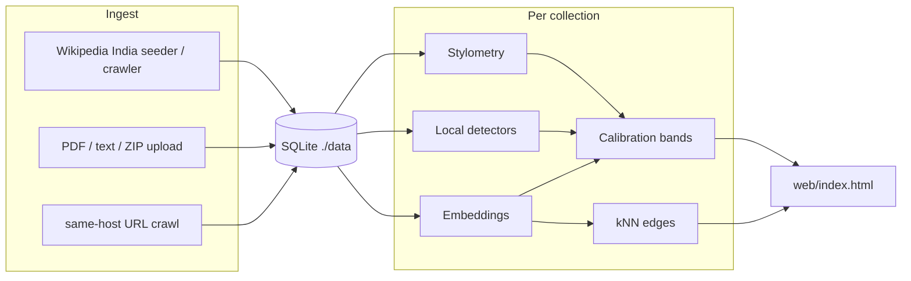

# KnowledgeOS

Collection-level estimate of how much of a document set looks AI-generated or AI-assisted.


Collections are independent. 3 sources of data are being used : Wikipedia India, a URL crawl named GDELT while allowing the user to give any public URL of choice or upload PDFs to check the amount of AI generated text in either a particular topic at hand or in their specific PDF.

## Experimental / recovered original (not this runtime)

An **experimental** snapshot of an earlier tree lives at [https://github.com/shrutiebony/KnowledgeOS/tree/recovered-original-project-2026-09-23](https://github.com/shrutiebony/KnowledgeOS/tree/recovered-original-project-2026-09-23). That branch is a **recovered original**, archival / experimental only. 

This repository’s runtime is **C++20 + CMake** (`knowledgeos.exe`).

## Where it is running

Runtime is still **C++20** + **CMake** (`knowledgeos.exe`). The shared demo is a Cloudflare quick tunnel GCP.
| | URL |
| --- | --- |
| Public (Cloudflare quick tunnel) | [https://full-definition-hundreds-bye.trycloudflare.com](https://full-definition-hundreds-bye.trycloudflare.com) |
| Local | [http://localhost:8080](http://localhost:8080) |

Honest limits: the PC must stay on; the tunnel URL can change when the tunnel is restarted; there is **no auth**; every visitor on that process (localhost and the public tunnel) shares the same datasets.

## Architecture

**C++20** + **CMake 3.20+** is the only runtime. SQLite file store at `./data/knowledgeos.db` (Docker: `/data/knowledgeos.db`). HTTP via cpp-httplib.

| Piece | What it does |
| --- | --- |
| Ingest | Simple PDF text extract; UTF-8 / HTML / JSONL / ZIP uploads; same-host URL crawl (depth 2, up to 80 pages). Wikipedia India is a separate crawler. |
| Analysis | Stylometry (TTR, burstiness, entropy, …), local detectors (stock phrases, sentence uniformity, n-gram repetition), hashed embeddings, collection-relative anomaly + deviation. |
| Calibration | Logistic blend of those signals + a modest post-ChatGPT date prior; rank mix; bands `LIKELY_AI` / `LIKELY_HUMAN` / `UNCERTAIN`. GraphSAGE is omitted from the headline. |
| Graph | Per-collection kNN on embedding cosine (`k=8`, min cosine `0.32`). The UI draws a circular cluster layout (unlabeled dots, subheading labels). |
| Wikipedia India | On start (if seeding is on): background crawl from India seeds, or a small offline fixture if crawl is off / unreachable. |
| GraphSAGE | Gated. Mean-aggregation fallback only. `usedInHeadline` is always false. Optional offline helper: `tools/graphsage/graphsage_embed.py`. |

On each process start, leftover collections that are **not** named `Wikipedia India` or `GDELT` are pruned. New uploads and URL crawls still work during that run.



## Build and run (Windows)

Needs **CMake 3.20+** and **MSVC** (Visual Studio Build Tools) or MinGW.

From this directory:

```bat
call "C:\Program Files (x86)\Microsoft Visual Studio\18\BuildTools\VC\Auxiliary\Build\vcvars64.bat"
cmake -S . -B build -G "NMake Makefiles" -DCMAKE_BUILD_TYPE=Release
cmake --build build
```

Binary: `build/knowledgeos.exe` (the `web/` dashboard is copied next to it).

```bat
set KNOWLEDGEOS_WIKIPEDIA_INDIA_CRAWL=false
build\knowledgeos.exe
```

Open [http://localhost:8080](http://localhost:8080).

To live-crawl English Wikipedia (same-host `en.wikipedia.org`, default cap **2000** pages, depth 4):

```bat
set KNOWLEDGEOS_WIKIPEDIA_INDIA_CRAWL=true
set KNOWLEDGEOS_WIKIPEDIA_INDIA_MAX_PAGES=2000
build\knowledgeos.exe
```

The app binds to 8080 first when crawl is on (crawl runs in a background thread). Header pills fill as pages are scored. If Wikipedia is unreachable, the small offline India fixture is installed so the dashboard still has a collection.

SQLite lives under `./data/knowledgeos.db`. Leave that directory in place so the India corpus can resume instead of starting over.

### Linux / Docker

```bash
cmake -S . -B build -DCMAKE_BUILD_TYPE=Release
cmake --build build
./build/knowledgeos
```

or

```bash
docker compose up --build
```

Cloud Run uses the same C++ `Dockerfile`. Containers honor `PORT`.

## How to use the dashboard

Same product UI as the public demo and localhost.

1. **Dataset** — pick a collection, then **Refresh**. Wikipedia India is the seeded corpus. Each upload or URL crawl is its own row. 
2. **Wikipedia topic** — only on Wikipedia India. A **view** on that same collection. It does not create another dataset.
3. **Header pills** — share of documents, share of analyzed words, uncertainty range, and band counts (likely AI / likely human / uncertain). Read-only. Estimates, not proof. GraphSAGE is not in these numbers.
4. **Document graph** — circular layout: unlabeled dots are documents; one subheading sits on each cluster. Hover a dot for the title. Edges are embedding similarity.
5. **Click a heading or cluster** — the graph zooms to that visible set and **Analysis across collection** follows it. **Explain insights** reads that same visible set and opens a short estimate in the popup (no API key required).
6. **Click a document** — highlights it in the analysis panel and opens the detail card.
7. **Upload PDFs or text** — `.pdf`, `.txt`, `.md`, `.html`, `.jsonl`, `.zip`. Creates a `USER_UPLOAD` collection.
8. **Public URLs** — one URL per line, optional name (e.g. `gdelt`). Same-site children only (depth 2, up to 80 pages). Stored as `USER_URLS`, never mixed into Wikipedia.
9. **AI share over time** — yearly bins from last-modified (HTTP `Last-Modified` / page meta), not the year the prose was written. Hidden if the collection has no dates.
10. **Delete** — shown for every collection except Wikipedia India.

There is **no POST that creates a Wikipedia subset dataset**. `topic=` and `ids=` are view filters only.

## Lifecycle of one additional collection (URL crawl or PDF/text)

Wikipedia India is already seeded. The full life of **one extra collection**, a public URL (same-site crawl) **or** a PDF/text upload is as follows:

Open the shared demo at [https://full-definition-hundreds-bye.trycloudflare.com](https://full-definition-hundreds-bye.trycloudflare.com) or [http://localhost:8080](http://localhost:8080). Both hit the same `knowledgeos.exe` process and the same SQLite file.

### 1. Add it

**Public URL (same-site crawl).** In **Public URLs**, paste one URL per line (optional name, e.g. `gdelt`). **Crawl same-site pages and analyze** calls `POST /datasets/from-urls`. The crawler fetches each seed, then follows in-site child links only (depth 2, up to 80 pages). Stored as kind `USER_URLS`.

**Or upload PDF / text.** Choose `.pdf`, `.txt`, `.md`, `.html`, `.jsonl`, or `.zip`, optional dataset name, then **Upload and analyze**. That is `POST /datasets/upload`, kind `USER_UPLOAD`.

Either path writes a **new** collection in `./data/knowledgeos.db`. Pages from that crawl or upload stay in that collection only. They are never appended to Wikipedia India.

**Wikipedia topic is not this step.** The topic dropdown is a view filter on Wikipedia India only. Changing it does not create a dataset. There is no POST that materializes a Wikipedia subset.

### 2. It appears for every visitor

`GET /datasets` lists the new row. It shows up in the **Dataset** dropdown for **all** visitors on this process — you on localhost and anyone on the public tunnel. This is a shared demo, not a private instance. Pick the new name and **Refresh**.

### 3. Open it

Selecting that collection scopes every panel to its documents only:

- **Analysis across collection** — share of documents, share of analyzed words, uncertainty range, and example cards.
- **Bands** — counts and examples for `LIKELY_AI`, `LIKELY_HUMAN`, and `UNCERTAIN` (AI if `p >= 0.58`, human if `p <= 0.42`, otherwise uncertain, or if the interval is wider than `0.50`).
- **Document graph** — circular cluster layout (unlabeled dots, one heading per cluster). Hover a dot for the title. Edges are embedding cosine (`k=8`, min cosine `0.32`). Click a heading or cluster to zoom; analysis follows that visible set.
- **AI share over time** — yearly estimate binned by **last-modified** (HTTP `Last-Modified` or page meta such as `article:modified_time`), not the year the prose was written. A later date can mean an edit. If the collection has no dates (common for many PDF uploads), the chart stays hidden.

Click a document to highlight it in analysis and open the detail card (signals, neighbors, text).

### 4. Explain insights on the visible set

**Explain insights** (on the graph card and on Analysis across collection) posts `POST /datasets/{id}/insights` with the same `topic=` / `ids=` scope as the graph. It reads the **visible** set — the whole extra collection, or the cluster you clicked, and opens a short estimate in the popup.
### 5. Delete it

Any collection **except** Wikipedia India can be removed. The dashboard **Delete** button (hidden on Wikipedia India) calls `DELETE /datasets/{id}`. Documents, edges, and scores for that id go away; other collections stay separate. Wikipedia India is refused (`403`).
### 6. How long it lasts

