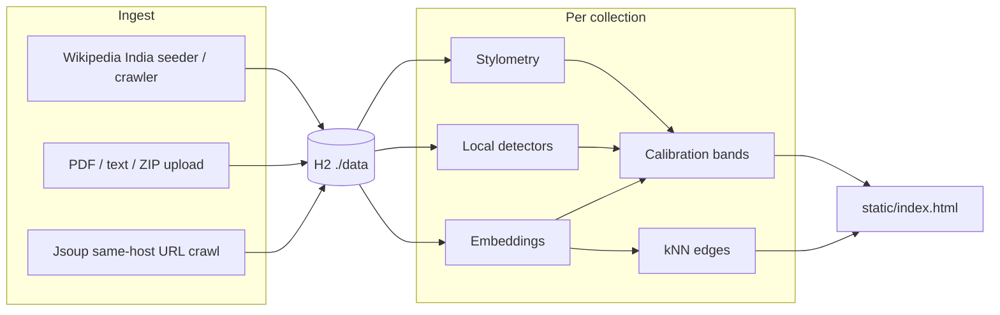

# KnowledgeOS

Collection-level estimate of how much of a document set looks AI-generated or AI-assisted.

This is **not** proof of authorship, not a Q&A / RAG system, and not HITS. GraphSAGE neighborhood embeddings are optional graph context only. They are **not** in the share number.

Collections are independent. Wikipedia India, a URL crawl named GDELT, PDF/text uploads, and other URL crawls do not share graphs or baselines.

## Architecture

Spring Boot **3.3.5** / Java **21**. H2 file store at `./data/knowledgeos` (Docker: `/data/knowledgeos`). The dashboard is `src/main/resources/static/index.html` at `/`.

| Piece | What it does |
| --- | --- |
| Ingest | PDFBox for PDFs; UTF-8 / HTML / JSONL / ZIP uploads; Jsoup same-host URL crawl (depth 2, up to 80 pages). Wikipedia India is a separate crawler. |
| Analysis | Stylometry (TTR, burstiness, entropy, …), local detectors (stock phrases, sentence uniformity, n-gram repetition), hashed or optional remote embeddings, collection-relative anomaly + deviation. |
| Calibration | Logistic blend of those signals + a modest post-ChatGPT date prior; rank mix; bands `LIKELY_AI` / `LIKELY_HUMAN` / `UNCERTAIN`. GraphSAGE is omitted. |
| Graph | Per-collection kNN on embedding cosine (`k=8`, min cosine `0.32`). The UI draws a circular cluster layout (unlabeled dots, subheading labels). |
| Wikipedia India | On start (if seeding is on): background crawl from India seeds, or a small offline fixture if crawl is off. |
| GraphSAGE | Gated. Python script `tools/graphsage/graphsage_embed.py` if present; otherwise a mean-aggregate fallback. `usedInHeadline` is always false. |

On each process start, leftover collections that are **not** named `Wikipedia India` or `GDELT` are pruned. New uploads and URL crawls still work during that run.



## Start locally

Needs **JDK 21** and **Maven**, or Docker.

Optional Windows paths used on this machine:

- JDK: `C:\Users\sgoya\.jdks\openjdk-26.0.2`
- Maven: `C:\Users\sgoya\apache-maven-3.9.6`

```bash
mvn spring-boot:run
```

or

```bash
docker compose up --build
```

Open [http://localhost:8080](http://localhost:8080).

On first start, Wikipedia India crawls in the background (default cap **2000** pages, depth 4). The app binds to 8080 first; header pills fill as pages are scored. To skip the live crawl and load the small offline India fixture:

```bash
set KNOWLEDGEOS_WIKIPEDIA_INDIA_CRAWL=false
mvn spring-boot:run
```

H2 files live under `./data` (Compose maps `./data` → `/data`). Leave that directory in place so the India corpus can resume instead of starting over.

## Use the deployed version

Same dashboard as local. There is no separate product UI.

**If you already have a Cloud Run URL** (`https://…run.app`), open that. **If not**, use [http://localhost:8080](http://localhost:8080) until you deploy. Cloud Run still needs `gcloud` login, a GCP project, and a **billing account** (free-tier Cloud Run is not bill-less). The container disk is ephemeral, so keep the Wikipedia crawl off on Cloud Run.

```bash
gcloud run deploy knowledgeos --source . --region us-central1 --allow-unauthenticated --port 8080 --memory 1Gi --cpu 1 --min-instances 0 --max-instances 1 --timeout 300 --set-env-vars "KNOWLEDGEOS_WIKIPEDIA_INDIA_CRAWL=false,KNOWLEDGEOS_SEED_WIKIPEDIA=true"
```

Then use the URL `gcloud` prints. The app has no login — treat a public URL as a public demo.

### How to use the dashboard

1. **Dataset** — pick a collection, then **Refresh**. Wikipedia India is the seeded corpus. Uploads and URL crawls appear as their own rows. A collection named `gdelt` / `GDELT` is kept across restarts; other extra names last for the running process.
2. **Wikipedia topic** — only on Wikipedia India. Filters the **same** collection. It does not create another dataset.
3. **Header pills** — share of documents, share of analyzed words, uncertainty range, and counts (likely AI / likely human / uncertain). Read-only. Estimates, not proof. GraphSAGE is not in these numbers.
4. **Document graph** — unlabeled dots are documents; one subheading sits on each cluster (Wikipedia category, or source / band when a topic is already selected). Hover a dot for the title. Edges are embedding similarity.
5. **Click a heading or cluster** — the graph zooms to that visible set and **Analysis across collection** follows it. **Show all** (or empty space) restores the full graph.
6. **Click a document** — highlights it in the analysis panel and opens the detail card (signals, neighbors, text). Collection figures stay.
7. **Analysis across collection** — always on screen for whatever is visible (full graph, topic slice, or one cluster). Example cards and cluster mix sit in the same panel.
8. **AI share over time** — yearly series when documents have dates; hidden otherwise.
9. **Upload PDFs or text** — `.pdf`, `.txt`, `.md`, `.html`, `.jsonl`, `.zip`. Optional dataset name. Creates a `USER_UPLOAD` collection and analyzes it. `data/examples/medical` is a local second-collection sample.
10. **Public URLs** — one URL per line, optional name (e.g. `gdelt`). Same-site children only (depth 2, up to 80 pages). Stored as `USER_URLS`, never mixed into Wikipedia. Child pages keep that seed as their source.

**How to use** in the header repeats this in the app.

## Environment variables

Spring Boot relaxed binding of `application.properties`. Defaults below match the file.

| Env var | Property | Default | Notes |
| --- | --- | --- | --- |
| `SERVER_PORT` | `server.port` | `8080` | Container also honors `PORT` via the Dockerfile entrypoint. |
| `SPRING_APPLICATION_NAME` | `spring.application.name` | `KnowledgeOS` | |
| `SPRING_DATASOURCE_URL` | `spring.datasource.url` | `jdbc:h2:file:./data/knowledgeos;AUTO_SERVER=TRUE` | Image sets `jdbc:h2:file:/data/knowledgeos;AUTO_SERVER=TRUE`. |
| `SPRING_DATASOURCE_DRIVER_CLASS_NAME` | `spring.datasource.driverClassName` | `org.h2.Driver` | |
| `SPRING_DATASOURCE_USERNAME` | `spring.datasource.username` | `sa` | |
| `SPRING_DATASOURCE_PASSWORD` | `spring.datasource.password` | *(empty)* | |
| `SPRING_JPA_HIBERNATE_DDL_AUTO` | `spring.jpa.hibernate.ddl-auto` | `update` | |
| `SPRING_JPA_OPEN_IN_VIEW` | `spring.jpa.open-in-view` | `false` | |
| `SPRING_H2_CONSOLE_ENABLED` | `spring.h2.console.enabled` | `true` | |
| `SPRING_SERVLET_MULTIPART_MAX_FILE_SIZE` | `spring.servlet.multipart.max-file-size` | `32MB` | |
| `SPRING_SERVLET_MULTIPART_MAX_REQUEST_SIZE` | `spring.servlet.multipart.max-request-size` | `64MB` | |
| `KNOWLEDGEOS_EMBED_URL` | `knowledgeos.embed.url` | *(empty)* | Optional remote embed; otherwise local hashed 128-d vectors. |
| `KNOWLEDGEOS_EMBED_DIM` | `knowledgeos.embed.dim` | `128` | |
| `KNOWLEDGEOS_GRAPH_K` | `knowledgeos.graph.k` | `8` | kNN neighbors per document. |
| `KNOWLEDGEOS_GRAPH_MIN_COSINE` | `knowledgeos.graph.min-cosine` | `0.32` | |
| `KNOWLEDGEOS_GRAPHSAGE_PYTHON` | `knowledgeos.graphsage.python` | `python` | |
| `KNOWLEDGEOS_GRAPHSAGE_SCRIPT` | `knowledgeos.graphsage.script` | `tools/graphsage/graphsage_embed.py` | |
| `KNOWLEDGEOS_SEED_WIKIPEDIA` | `knowledgeos.seed.wikipedia` | `true` | If false, skip India seed/crawl entirely. |
| `KNOWLEDGEOS_CRAWL_MAX_DEPTH` | `knowledgeos.crawl.max-depth` | `2` | Generic URL crawler only. |
| `KNOWLEDGEOS_CRAWL_MAX_PAGES` | `knowledgeos.crawl.max-pages` | `80` | Generic URL crawler only. |
| `KNOWLEDGEOS_CRAWL_TIMEOUT_MS` | `knowledgeos.crawl.timeout-ms` | `12000` | |
| `KNOWLEDGEOS_CRAWL_DELAY_MS` | `knowledgeos.crawl.delay-ms` | `200` | |
| `KNOWLEDGEOS_WIKIPEDIA_INDIA_CRAWL` | `knowledgeos.wikipedia-india.crawl` | `true` | `false` → offline India fixture. |
| `KNOWLEDGEOS_WIKIPEDIA_INDIA_MAX_PAGES` | `knowledgeos.wikipedia-india.max-pages` | `2000` | Independent of the generic crawler. |
| `KNOWLEDGEOS_WIKIPEDIA_INDIA_MAX_DEPTH` | `knowledgeos.wikipedia-india.max-depth` | `4` | |
| `KNOWLEDGEOS_WIKIPEDIA_INDIA_DELAY_MS` | `knowledgeos.wikipedia-india.delay-ms` | `300` | |
| `KNOWLEDGEOS_WIKIPEDIA_INDIA_TIMEOUT_MS` | `knowledgeos.wikipedia-india.timeout-ms` | `15000` | |
| `KNOWLEDGEOS_WIKIPEDIA_INDIA_FLUSH_EVERY` | `knowledgeos.wikipedia-india.flush-every` | `25` | Incremental score flush during crawl. |
| `KNOWLEDGEOS_BAND_AI_MIN` | `knowledgeos.band.ai-min` | `0.58` | Band thresholds; not proof. |
| `KNOWLEDGEOS_BAND_HUMAN_MAX` | `knowledgeos.band.human-max` | `0.42` | |
| `KNOWLEDGEOS_BAND_MAX_INTERVAL` | `knowledgeos.band.max-interval` | `0.50` | Wider interval → uncertain. |
| `KNOWLEDGEOS_CALIBRATE_RANK_MIX` | `knowledgeos.calibrate.rank-mix` | `0.38` | Mix of raw p(AI) with collection rank. |
