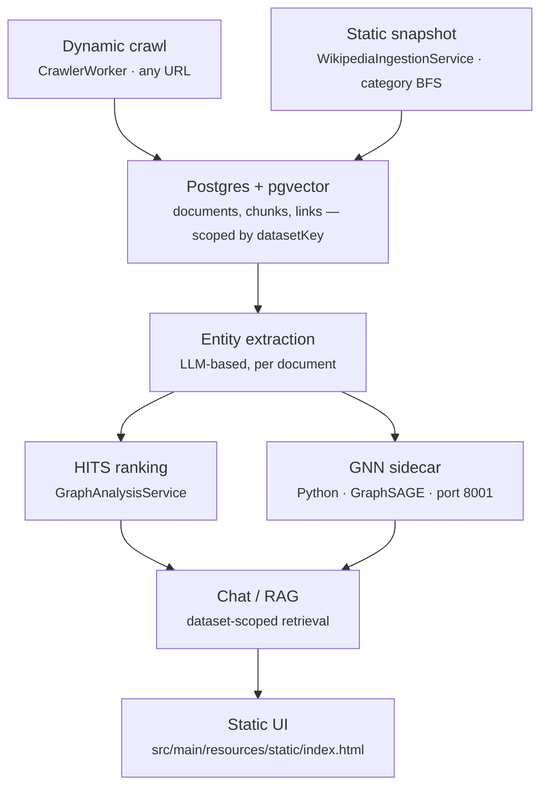

# KnowledgeOS

A research platform for building and querying knowledge graphs: crawl or ingest
content, extract entities and relationships, rank the resulting graph with
HITS, learn node embeddings and predict missing links with a GNN, and answer
questions over it with RAG-based chat — with every one of those steps scoped
to an isolated **dataset**, so multiple independent graphs can live in the
same instance without contaminating each other's rankings, training, or
answers.

## Why dataset-scoping matters

Most of this system's design decisions exist to support one idea: a **static,
bounded, reproducible snapshot** (e.g. a Wikipedia category tree on a fixed
topic) and an **open-ended dynamic crawl** (any URL) can run side by side,
and every downstream computation — HITS, GNN training, chat retrieval — only
ever sees the one dataset it was asked about. Nothing global, nothing shared
across datasets except the underlying Postgres instance.

## Architecture



## The two ingestion paths

**Dynamic crawl** (`CrawlerWorker`) follows same-host hyperlinks starting from
any URL you give it. Bounded per dataset via
`crawler.max-pages-per-dataset` (default 300) — once a dataset hits that
document count, the crawler stops queuing newly discovered links (it still
records the link edges themselves, since those matter for HITS even for
pages that were never crawled).

**Static snapshot** (`WikipediaIngestionService`) BFS's a fixed set of
Wikipedia categories down to a given depth, pulls each article's plaintext
and internal links via the MediaWiki API, and keeps only links that point to
another title already inside that bounded set. The result is a closed,
topically-coherent graph decided up front — not discovered by following
links wherever they lead.

Both paths write into the same `Document` / `PageLink` schema, tagged with a
`datasetKey`, so every downstream step (chunking, embedding, entity
extraction, HITS, GNN, chat) works identically regardless of which path
produced the data.

## Core pipeline, once data exists in a dataset

1. **Chunking + embedding** — `ChunkingService` splits documents into chunks
   and embeds them via a sentence-embedding service, stored as
   `vector(384)` columns in Postgres (pgvector).
2. **Entity extraction** — an LLM-based scheduler (`EntityExtractionService`)
   pulls entities and relationships out of each document's content,
   resolving entities per-dataset (`GraphEntity` uniqueness is
   `(name, datasetKey)`, not global).
3. **HITS** — `GraphAnalysisService` computes hub/authority scores over the
   link graph, scoped to one dataset's documents and links.
4. **GNN** — a Python sidecar (`gnn-service/`) trains a GraphSAGE model over
   the extracted entity graph, producing node embeddings and predicted
   links, callable via `POST /gnn/train`.
5. **Chat / RAG** — `SearchService` runs pgvector similarity search scoped to
   one dataset's chunks; `ChatService` builds a grounded answer from the
   retrieved context.

## Tech stack

| Layer | Technology |
|---|---|
| Backend | Java 21, Spring Boot 3.5, Hibernate |
| Database | PostgreSQL 16 + pgvector |
| GNN sidecar | Python, FastAPI, PyTorch (GraphSAGE) |
| UI | Static HTML/CSS/JS, no build step, served by Spring Boot |
| Deployment | Docker, Render (`render.yaml` blueprint) |

## Running it locally

```bash
docker compose up -d          # Postgres + GNN sidecar
# once Postgres is up, one-time: CREATE EXTENSION vector;
mvn spring-boot:run           # backend, serves the UI at localhost:8080
```

## Running it on Render

`render.yaml` provisions all three services (managed Postgres, the GNN
sidecar, and the backend) from one blueprint. After the Postgres instance is
created, run `CREATE EXTENSION vector;` once against it via Render's psql
console — this one step isn't automatable through the blueprint itself.

## API reference

| Endpoint | Purpose |
|---|---|
| `GET /queue/add?url=&datasetKey=` | Queue a URL for the dynamic crawler |
| `GET /crawl?datasetKey=` | Crawl the next queued URL |
| `POST /datasets/wikipedia/build?categories=&maxDepth=&maxPages=&datasetKey=` | Build a static Wikipedia snapshot |
| `GET /documents?datasetKey=` | List documents in a dataset |
| `GET /datasets` | List every dataset key present |
| `DELETE /datasets/{key}` | Permanently delete a dataset and everything in it |
| `GET /status?datasetKey=` | Document/queue/chunk counts for a dataset |
| `GET /graph?datasetKey=` | Extracted entities and relationships |
| `GET /rank/compute?datasetKey=` | Run HITS |
| `POST /gnn/train?datasetKey=` | Train the GNN on a dataset's entity graph |
| `GET /gnn/predicted-links?datasetKey=` | GNN's predicted missing links |
| `GET /chat?query=&datasetKey=` | Ask a dataset-grounded question |

All dataset-scoped endpoints default to `datasetKey=default` if omitted.

## Known limitations

- No authentication on any endpoint — fine for local/private use, a real
  concern before leaving this publicly deployed for any length of time
  (in particular `DELETE /datasets/{key}`, which is irreversible).
- The dynamic crawler's page cap is a soft limit — a handful of
  already-queued items can push slightly past it before it fully stops.
- `GnnEmbedding`/`PredictedLink` tables assume Hibernate schema creation on
  an empty database; adding `NOT NULL` columns to a populated database
  requires a manual backfill migration, not automatic `ddl-auto=update`.